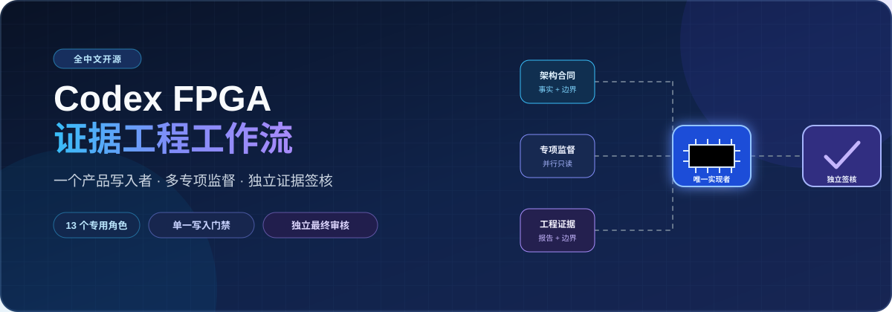
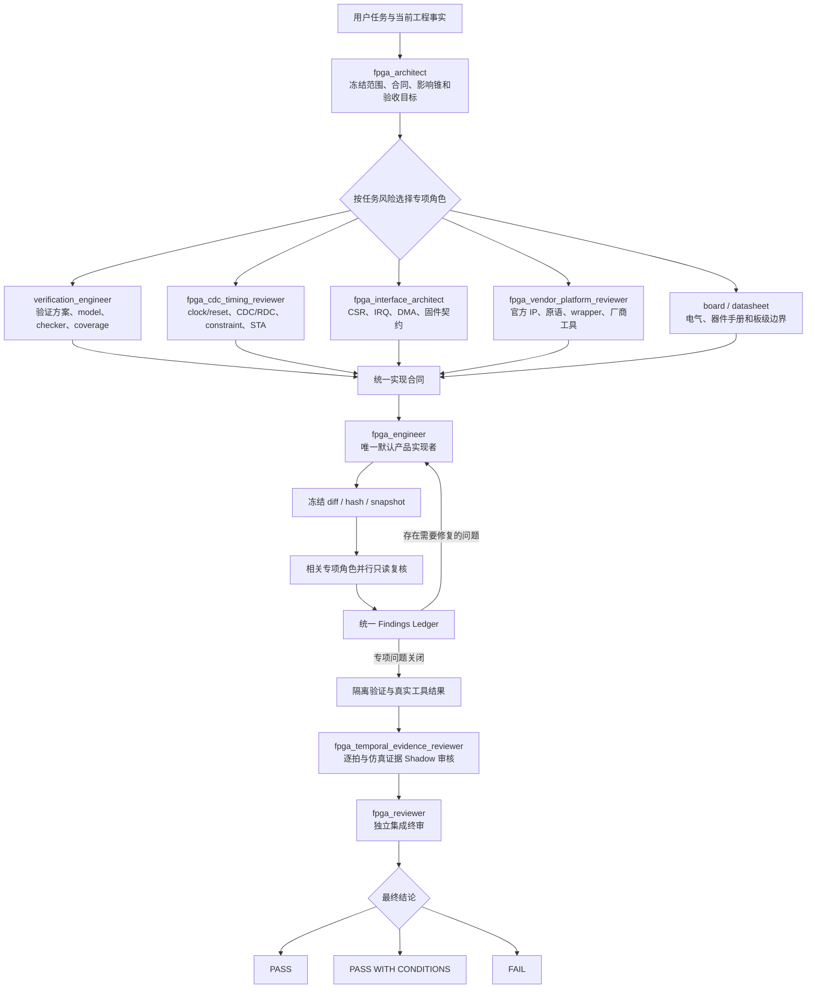

# Codex FPGA 中文工程工作流

<div align="center">



### 让 Codex 不只会写 RTL，还能像真正的 FPGA 工程团队一样分析、实现、验证和审核

[](https://github.com/prasetyarobert205-jpg/codex-fpga-engineering-workflow-zh/actions/workflows/validate.yml)
[](LICENSE)
[](CHANGELOG.md)
[](docs/README.md)

**13 个 FPGA 专用角色 · 单一产品实现者 · 多专项独立监督 · 逐拍 RTL 推理 · CDC/RDC/STA · 官方 IP · 三厂商工具流 · 独立终审**

[快速开始](#快速开始) · [为什么值得使用](#为什么值得使用) · [工作流程](#工作流程) · [角色优势](#13-个角色分别解决什么问题) · [使用场景](#适合解决哪些问题) · [完整文档](docs/README.md)

</div>

## 这是什么

Codex FPGA 中文工程工作流是一套可以安装到 Codex 中的 FPGA/SoC FPGA 多角色工程系统。

它不是简单地给模型增加一句：

> “你现在是一名 FPGA 工程师。”

而是把真实 FPGA 项目中不同专业人员的责任拆开：

- 架构师负责需求、接口、吞吐、延迟、影响范围和验收标准；
- 唯一产品实现者负责修改 RTL、官方 IP、构建脚本或物理实现；
- 验证工程师负责 TB、reference model、assertion 和 scoreboard；
- CDC/时序专家负责时钟、复位、跨时钟域、约束和 STA；
- 厂商专家负责 Xilinx、Pango、Anlogic 的 IP、原语和工具差异；
- 逐拍审核角色按真实时钟沿检查 pipeline、FSM、FIFO/RAM 和 valid/ready；
- 最终审核者不参与原实现，只根据冻结代码和专项证据独立给出结论。

最终目标不是“让 AI 更会生成 HDL”，而是：

> 让每一次 FPGA 修改都能回答：改了什么、为什么改、哪一拍发生了什么、影响了哪些信号、运行了哪些验证、还有哪些结论没有证据。

## 为什么值得使用

### 1. FPGA 代码不是普通软件代码

软件代码通常按照语句执行顺序理解，而 FPGA RTL 描述的是同时存在、按时钟沿更新的硬件。

一个看似简单的修改，可能影响：

- 当前拍采样的是新值还是旧值；
- nonblocking assignment 的 RHS 在哪一拍读取；
- pipeline 中 data、valid、last、tag、error 是否对齐；
- backpressure 时 payload 是否保持稳定；
- FIFO 同拍 push/pop 后 count、empty、full 是否正确；
- RAM 实际读延迟是一拍、两拍还是厂商模式相关；
- reset release 后第一笔 transaction 是否丢失；
- 跨时钟域脉冲是否会漏掉或重复；
- 约束是否覆盖真实路径；
- 综合后是否产生过深的 MUX、比较链、算术链或高扇出路径。

这套工作流要求对非平凡时序逻辑按真实边沿推导：

```text
pre-edge 旧状态
→ 判断 event 和赋值优先级
→ RHS 使用旧值采样
→ NBA 提交新寄存器值
→ post-edge 新状态
→ 组合逻辑稳定
→ 下一采样沿
```

因此，它更适合分析 FPGA 中最容易出现的“仿真偶尔不对”“差一拍”“背压时错位”“上板后偶发”的问题。

### 2. 一个实现者，多个独立监督者

多角色并不等于多个 Agent 同时修改同一份代码。

本工作流始终保持：

```text
一个产品源码实现者
+
多个只读专项审核者
+
一个独立最终审核者
```

实现者完成一个完整模块、影响锥、时钟域、IP 或脚本批次后，冻结 diff/hash。

相关专项角色针对同一个 snapshot 并行检查：

- 功能；
- 逐拍时序；
- CDC/RDC；
- 约束和 STA；
- CSR/IRQ/DMA；
- 厂商 IP 和工具流；
- 仿真模型与 checker；
- 板级风险。

所有问题进入同一个 findings ledger，再由原实现者按稳定 finding ID 修复。

这样可以避免：

- 多个 Agent 同时写同一个 checkout；
- 一个角色刚改完，另一个角色基于旧代码继续审核；
- 审核者自己改代码、自己宣布通过；
- 同一个问题在修复循环中不断换名字；
- 为了让仿真通过而错误修改产品 RTL。

### 3. 仿真作者不能给自己打分

很多“仿真通过但波形仍有问题”的根源不是 DUT，而是验证资产本身不独立。

常见问题包括：

- reference model 复制了 DUT 的算法；
- checker 读取 DUT 内部状态决定 expected；
- DUT 慢了一拍后，测试也跟着改成慢一拍；
- scoreboard 没排空就结束；
- 仿真退出码为 0，但实际没有完成检查；
- 只看一段“看起来正常”的波形；
- checker 从未证明自己能抓住真实错误。

本工作流明确区分：

```text
verification_engineer
→ 编写 TB、model、assertion、scoreboard 和回归

fpga_temporal_evidence_reviewer
→ 独立审核逐拍和仿真证据

fpga_reviewer
→ 集成所有证据，给出最终结论
```

当仿真用于正式功能接受时，需要：

- 明确 accepted edge；
- 明确 due cycle 或允许窗口；
- 检查 early、late、drop、duplicate、reorder；
- 检查 data 和 sideband 对齐；
- scoreboard 完整排空；
- 明确 X/Z policy；
- 至少一个能被 checker 抓住的 negative canary；
- 验证资产作者不能自签。

因此：

```text
日志结束 ≠ 功能通过
退出码 0 ≠ 功能通过
$stop ≠ 功能通过
波形看起来正常 ≠ 功能通过
```

### 4. 严格度跟随任务，不把所有项目都审成发布级

这套工作流不是每次修改都调用 13 个角色，也不是每次 compile 都要求完整 formal、CDC、STA 和板级证据。

它按照当前目标选择证据深度：

| 证据模式 | 适用情况 | 能证明什么 |
|---|---|---|
| `DIAGNOSTIC_SMOKE` | 路径、工具、库、compile、elaboration、有限运行 | 只证明对应阶段执行成功 |
| `FUNCTIONAL_ACCEPTANCE` | 仿真结果用于接受 DUT 功能 | 证明指定功能需求和时序行为 |
| `SPECIALIST_ACCEPTANCE` | CDC/RDC、STA、formal、电气、发布 | 只证明被调用的专业证据域 |

例如：

- 用户只问脚本为什么打不开 ModelSim，不需要完整检查 P&R；
- 用户只要求最小修改一个局部 RTL，不自动生成 bitstream；
- 用户要求定位 CDC warning，才调用 CDC/时序角色；
- 用户要求改善 WNS/TNS，才进入物理实现闭环；
- 功耗默认不启用，除非项目真的有功耗、热或安全预算。

这样既保留专业性，又避免过度审核。

### 5. 大型工程不会让一个 Reviewer 盲目遍历全部代码

FPGA 工程可能包含数百个 RTL 文件、多个时钟域、大量 IP、复杂 generate 和共享状态。

本工作流不会默认要求逐拍 Reviewer 扫描整个仓库，而是限定：

```text
一个主时钟域
+
一个 transaction/dataflow impact cone
+
相关的 ready/backpressure
+
全部耦合 sideband
```

范围跨多个时钟域、包含无法限定的共享状态、依赖未解析 package/macro/generate、存在未知厂商 black box 或没有稳定边界时，Reviewer 返回 `NEEDS_PARTITION`，由架构师重新分片并合并 findings。

这比“截取一小段代码后声称全仓审核完成”更可靠，也比每次全仓扫描更节省时间。

### 6. 官方 IP 不靠猜，也不直接复制网上配置

厂商 IP 对工具版本、器件、端口、参数、latency、reset、output products、仿真模型和约束都可能敏感。

本工作流使用明确决策顺序：

```text
当前工程已有 managed IP 且合同匹配
→ 直接复用

只缺 output products
→ 使用本机同版本官方工具增量生成

复制或旧 IP
→ 检查 source view 与输出路径所有权
→ staging/import 或官方重建

新 IP 且官方 Tcl/CLI 已确认
→ 脚本化生成

当前版本无法可靠脚本化
→ 操作官方 GUI 一次
→ 立即导出可复现 recipe
```

互联网只用于查询同版本官方手册、参数、命令和限制，不直接下载某个 XCI、IDF 或 IPC 当成产品配置。

### 7. 布局布线和时序优化从真实报告出发

时序收敛不是不断更换 seed、strategy 或随意插拍。

当任务进入 `IMPLEMENTATION_QOR` 或 `TIMING_CLOSURE` 时，工作流要求：

1. 冻结 tool、version、part、源码、约束、seed 和 strategy；
2. 建立 synth/place/route 基线；
3. 找到最高影响路径或拥塞点；
4. 分类 logic depth、route delay、high fanout、congestion、clocking、RAM/DSP/GT/IO placement 或 constraint coverage；
5. 一次只改变一个主要变量；
6. 重跑必要 implementation stage；
7. 比较 WNS/TNS、hold、route status、资源和 runtime；
8. 只有真实改善才保留，否则回滚。

这样可以避免“换一个 strategy 碰运气”的不可复现优化。

### 8. 支持持续积累真实工程经验

这套工作流支持私有故障知识库，但不会把历史经验直接当成当前项目结论。

```text
历史错误签名
→ 检索候选案例
→ 核对 vendor/tool/version
→ 核对 subsystem、clock/reset、interface 和 trigger
→ 在当前工程重新验证
→ 才决定是否适用
```

只有根因确认、修复已验证、适用条件和反例明确，并具备必要真实工程证据的案例，才允许晋级跨项目复用。

## 工作流程



### 这个流程的关键点

- 架构师先限定问题，避免直接盲改代码；
- 只调用当前任务需要的专项角色；
- 产品源码始终由一个实现者负责；
- Reviewer 基于同一个冻结 snapshot；
- verification author 不能自签；
- 逐拍 Reviewer 不替代 CDC/STA；
- final reviewer 不重新重复所有专项，而是集成证据、处理冲突和检查阻塞项；
- 未执行的检查保持 `NOT RUN` 或 `UNVERIFIED`。

## 13 个角色分别解决什么问题

| 角色 | 主要能力 | 角色优势 |
|---|---|---|
| `fpga_architect` | 需求、接口、影响锥、微架构、性能预算、任务路由 | 防止模型在没有理解工程时直接改代码；让后续任务动态变化，而不是被第一次输入锁死 |
| `fpga_engineer` | RTL、官方 IP、构建流、物理实现、发布打包 | 唯一产品源码写入者，避免多个 Agent 同时改代码；五种模式限制每个写入批次范围 |
| `verification_engineer` | TB、reference model、assertion、scoreboard、回归 | 让验证从需求出发，而不是根据 DUT 当前行为修改 expected；负责验证资产但不能自签 |
| `fpga_temporal_evidence_reviewer` | pipeline、FSM、FIFO/RAM、valid/ready 的逐拍审核 | 专门发现差一拍、stall 错推进、metadata 错位和假仿真 PASS |
| `fpga_cdc_timing_reviewer` | clock/reset、CDC/RDC、constraint、STA、QoR | 把 crossing 结构、约束覆盖和 timing closure 分开判断，避免用 false path 掩盖结构问题 |
| `fpga_interface_architect` | CSR、command、IRQ、DMA、端序和原子性 | 防止 FPGA 与固件定义不一致，重点审核 W1C、并发事件、DMA ownership 和错误恢复 |
| `fpga_vendor_platform_reviewer` | Xilinx/Pango/Anlogic、官方 IP、原语、wrapper、target | 防止把一家厂商语义套到另一家；确保使用对应版本官方工具和模型 |
| `fpga_board_validation_engineer` | 上板步骤、ILA/SignalTap、示波器、逻辑分析仪 | 把仿真、实现和真实板级证据分开；物理动作由用户执行，角色提供停止条件和观测方案 |
| `fpga_reviewer` | 集成最终审核 | 不参与原实现，不自行修复；基于专项证据、冻结 snapshot 和未关闭 finding 给出结论 |
| `system_architect` | FPGA、硬件、固件跨领域架构 | 只在真正跨领域时启用，避免普通 FPGA 小改被过度扩大 |
| `embedded_engineer` | FPGA 相关驱动、寄存器、IRQ、DMA 固件 | 只有接口合同需要时才进入顺序写入批次，不与 FPGA 实现者争抢同一批次 |
| `hardware_datasheet` | 器件手册、页码、表格、电气和模型证据 | 防止凭记忆填写电压、时序、引脚、复位或器件参数 |
| `independent_reviewer` | 跨领域或安全关键发布审核 | 用于高风险 FPGA/硬件/固件联合发布，不机械参与普通任务 |

## 角色体系为什么比“再加一个 Reviewer”更重要

重点不是角色数量，而是责任边界。

### 实现者不能自签

```text
写代码的人
≠
最终宣布代码正确的人
```

### 验证作者不能自签

```text
写 checker 的人
≠
最终宣布 checker 已经证明 DUT 的人
```

### 专项 Reviewer 不替代最终 Reviewer

```text
CDC Reviewer
→ 只签 CDC/RDC 和相关约束证据

Temporal Reviewer
→ 只签逐拍与仿真证据

Vendor Reviewer
→ 只签厂商、IP 和 target 证据

Final Reviewer
→ 集成全部专项结论和剩余风险
```

### 不是所有任务都启动全部角色

```text
简单只读诊断
→ 架构师 + 相关专项

局部低风险修改
→ 架构师 + 实现者 + 验证复核 + 终审

CDC、IP、接口、时序或高风险修改
→ FULL 模式 + 对应专项角色
```

这让工作流既保持专业，又不会把所有任务变得过重。

## 适合解决哪些问题

- 阅读和梳理陌生 FPGA 工程；
- 定位 RTL 功能错误；
- 修复 FSM、counter、FIFO、RAM 和 pipeline；
- 检查 valid/ready、backpressure 和 sideband 对齐；
- 分析 reset release 和首笔 transaction；
- 审核 CDC/RDC warning；
- 检查异步 FIFO、pulse/toggle/handshake 和 Gray counter；
- 设计或审核 CSR、IRQ、DMA；
- 添加或修复官方厂商 IP；
- 诊断 Vivado、PDS、TD、ModelSim/Questa 脚本；
- 审核仿真模型、checker 和 scoreboard；
- 定位“自动仿真 PASS，但人工波形仍有问题”；
- 分析关键路径、高扇出、拥塞和布局布线；
- 准备安全上板、ILA/SignalTap 和仪器观测步骤；
- 对发布结论做独立审核；
- 把真实售后问题整理为可复用的私有故障经验。

## 它不会做什么

本工作流不会把前一级证据冒充后一级证据：

```text
源码审查
→ lint / elaboration
→ RTL 仿真
→ formal
→ CDC/RDC
→ 综合
→ implementation / STA
→ 仪器测量
→ 板级结果
```

因此：

- 源码看起来正确，不等于仿真通过；
- 仿真通过，不等于 CDC 安全；
- 综合通过，不等于时序闭合；
- bitstream 生成，不等于可以安全上板；
- 历史案例匹配，不等于当前工程根因相同；
- 没有真实报告时，不会声称“已验证”。

## 快速开始

### 让 Codex 帮你安装到当前 FPGA 工程

把下面内容发给 Codex：

```text
请把下面这个 FPGA 中文工作流以 Project scope 安装到当前 FPGA 工程：

https://github.com/prasetyarobert205-jpg/codex-fpga-engineering-workflow-zh

先克隆到独立目录，阅读 README、LICENSE 和安装脚本；
运行 validate-package.ps1；
使用 install.ps1 -Scope Project -ProjectPath <当前工程根> -WhatIf 预览；
列出将写入的角色和 Skill；
发现已有不同内容时停止，不使用 -Force；
我确认后再正式安装并运行 verify-install.ps1；
不要修改当前工程的 RTL、约束、IP、仿真文件或厂商工程。
安装完成后提醒我新开 Codex 会话。
```

### 安装后第一次使用

```text
使用 $run-fpga-workflow，以 ANALYZE 模式只读检查当前 FPGA 工程。

自动识别厂商、工具版本、工程入口、top、clock/reset、正式 build/sim/lint 入口和当前未提交改动。

不要修改文件。
不要猜测缺失的器件、时钟、复位、IP、约束或测试结果。
结论区分 CONFIRMED、INFERRED 和 UNKNOWN。
没有真实报告时标为 UNVERIFIED。
```

### 要求最小修改代码

```text
使用 $run-fpga-workflow。

任务：
修复 [问题描述]

允许：
只修改与根因直接相关的 RTL 和必要验证文件。

禁止：
不改接口；
不改寄存器；
不重生成 IP；
不改变 latency；
不生成 bitstream；
不进行板级动作。

先根据源码说明：
1. 根因是什么；
2. 为什么修改这个位置；
3. 为什么不扩大到其他模块；
4. 对 latency、throughput、clock/reset、CDC 和 error 的影响；
5. 最小验证方式。

然后实施最小修改。
未运行的综合、STA、CDC/RDC 和上板结果标为 UNVERIFIED。
```

## 推荐的 FPGA 工程目录

为了让产品源码、厂商工程、仿真资产、正式输出和 Codex 临时文件彼此分开，可以采用下面的推荐结构：

```text
<fpga-project>/
├─ document/                 # 需求、接口、寄存器和设计说明
├─ project/
│  ├─ rtl/                   # 产品 RTL
│  ├─ ip/                    # 厂商 IP 配置和生成 recipe
│  ├─ sdc/                   # 时钟、I/O 和时序约束
│  ├─ par/                   # 厂商工程、综合/实现数据库和报告
│  └─ script/                # 正式编译/构建入口和 Tcl/CLI
├─ simulation/
│  ├─ tb/case/               # TB、model、checker 和测试用例
│  ├─ script/                # 仿真入口和 source list
│  └─ work/                  # 仿真库、日志、WLF 和波形
├─ linter/                   # lint 配置、black box 和结果
├─ release/
│  ├─ golden/                # 可选 golden image
│  └─ output/                # 审核后的 bit/bin/mcs 和 manifest
└─ codex_out/                # Codex 诊断、索引、临时构建和审查证据
```

最重要的存放边界：

| 内容 | 推荐位置 |
|---|---|
| 正式综合、实现、时序报告 | `project/par/` |
| 正式 ModelSim/Questa 库、日志和波形 | `simulation/work/` |
| 审核后需要交付的产物 | `release/output/` |
| Codex 临时诊断、索引、变体和 review packet | `codex_out/<run-id>/` |

详细说明见：[FPGA 工程目录与文件存放位置](docs/project-layout.md)。已有成熟工程可以保留自己的目录，只要正式产品、正式输出和 Codex 临时文件边界清晰即可。

## 完整文档

- [总体架构](docs/architecture.md)
- [角色与分工](docs/roles.md)
- [项目优势](docs/advantages.md)
- [安装指南](docs/installation.md)
- [提示词与使用方法](docs/usage.md)
- [FPGA 工程目录与文件存放位置](docs/project-layout.md)
- [证据与安全边界](docs/safety-and-evidence.md)
- [公开与私有数据边界](docs/public-private-boundary.md)

## 当前边界

仓库 CI 可以证明角色数量和权限、Skill/schema/脚本格式、安装、哈希核对和工程脚手架符合包合同。

它不能自动证明任意具体项目的 DUT 功能、CDC/RDC、STA、厂商 IP、bitstream 或板级运行。具体工程结论始终以当前工程、当前工具版本和真实报告为准。

## 参与项目

如果你也遇到过这些问题：

- AI 写出的 RTL 能编译，但时序语义不对；
- 仿真自动显示 PASS，但人工波形发现错误；
- CDC warning 不知道是结构错误还是约束缺失；
- 官方 IP 在另一台电脑或另一版本工具中无法重现；
- 多个 Agent 来回修改，问题反复出现；
- P&R 优化只能不断换 strategy；
- 售后问题很多，但无法形成可靠的错误知识库；

欢迎 Star、试用、提交可复现 Issue，并分享它发现的问题和漏掉的问题。

[贡献指南](CONTRIBUTING.md) · [安全策略](SECURITY.md) · [MIT License](LICENSE)

---

<div align="center">

### 让下一次 FPGA 修改，不只是“代码写完了”

### 而是知道哪一拍发生了什么、哪份证据证明了什么、还有哪些风险尚未关闭

[开始安装](docs/installation.md) · [查看角色](docs/roles.md) · [复制提示词](docs/usage.md) · [提交 Issue](https://github.com/prasetyarobert205-jpg/codex-fpga-engineering-workflow-zh/issues)

</div>
