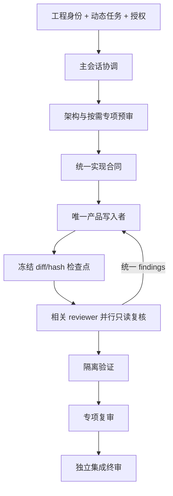

# 架构

[中文导航](README.md) · [角色](roles.md) · [安装](installation.md) · [使用](usage.md) · [证据与安全](safety-and-evidence.md)

## 核心模型

```text
并行只读专家
+
一个产品源码写入者
+
隔离验证
+
独立终审
```

工作流追求可审查 diff 和诚实证据，不追求角色数量最大化。

## 工程身份与动态任务

稳定 `project_identity` 保存工程根、canonical 工程入口、厂商、工具版本、
part、top、正式脚本入口和长期保护项。后续每轮问题生成动态：

```text
current_task
task_delta
authorization
protected_work
requested_claim
claim_stage
```

身份卡减少重复查找，但不会授权写入、clean、IP 重生成、implementation、
release、外部发布或板级动作。普通 follow-up 只刷新受影响 diff、影响锥和
证据；target 身份改变时才刷新基线。

## 生命周期



## 安全并行

允许并行：

- 同一稳定输入上的架构、验证、CDC、接口、厂商和板级只读分析；
- 同一冻结 diff 的多个专项复核；
- 使用独立目录、库、数据库、seed 和报告的 EDA job。

禁止并行：

- 多个角色同时修改同一产品 checkout；
- 产品、固件和验证资产写入批次重叠；
- 共享 Vivado run、ModelSim work、IP 生成目录等可变状态。

## 终审独立性

final reviewer 集成 task contract、claim stage、snapshot、专项报告、未关闭
BLOCKER/HIGH、冲突和声明边界。已有专项证据时只抽样最高风险，不重新完整
扫描所有 RTL/CDC/IP/仿真/P&R。缺失、过期或矛盾的证据返回对应专项角色。
