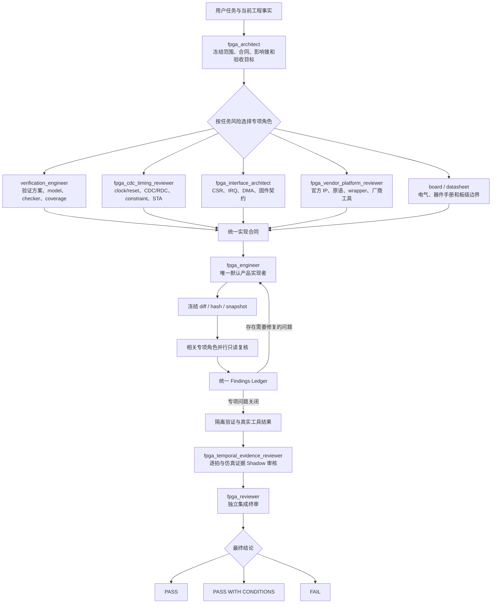

# 整体架构

[中文导航](README.md) · [项目优势](advantages.md) · [角色](roles.md) · [安装](installation.md) · [使用](usage.md) · [证据与安全](safety-and-evidence.md)

## 核心思想

这套工作流不是用更多 Agent 代替工程判断，而是把 FPGA 开发中容易互相冲突的职责分开：

```text
稳定工程事实
+
动态任务与当前授权
+
一个产品源码实现者
+
按需只读专项审核
+
独立验证证据
+
独立最终签核
```

设计重点是：谁能写、谁只能审、什么时候冻结代码、什么证据能支持什么结论。

## 完整工作流程



## 稳定工程身份与动态任务

工程中相对稳定的事实放入 `project_identity`：

```text
工程根
厂商与工具版本
目标器件
产品 top / 仿真 top
正式工程与脚本入口
长期保护项
```

用户后续每一个实质性问题都生成动态任务：

```text
current_task
task_delta
authorization
protected_work
requested_claim
claim_stage
```

这种拆分解决两个问题：

1. 同一工程不需要每轮重新扫描和重复填写身份卡；
2. 后续问题可以补充、替换、扩大或缩小当前任务，不会被第一次输入永久锁死。

身份信息不会自动授权写 RTL、clean、IP 重生成、implementation、release、上传或板级动作。

## 单写入、多审核

### 为什么产品源码只有一个默认写入者

多个 Agent 同时修改同一 checkout，会产生：

- 基线漂移；
- 相互覆盖；
- reviewer 基于旧 diff；
- 难以确认哪个修改解决了 finding；
- EDA 数据库和仿真库互相污染。

因此 `fpga_engineer` 是唯一默认产品写入者。固件和验证资产只有在独立、顺序批次中写入。

### 为什么专项角色保持只读

专项角色的价值是提供独立视角。如果 CDC reviewer、temporal reviewer 或 final reviewer 直接修复自己发现的问题，就会同时成为作者和签核者，失去独立性。

Reviewer 的输出是：

```text
稳定 finding ID
+
证据位置
+
影响和触发条件
+
需要的修复与重测
```

实现者按 finding ID 修复，随后重新冻结 snapshot 并复审。

## Snapshot 与 Findings Ledger

每个审核或验证结论都必须绑定同一个冻结 snapshot。以下任一项变化时，受影响证据必须重新生成：

- RTL、约束、IP 或脚本；
- source list、define/include、parameter；
- TB、model、checker、assertion；
- target 或工具视图；
- dirty diff。

Finding 的身份不依赖行号，而是由 domain、module/contract、signal/path 和 trigger 组成。实现者只能标记 `FIXED_PENDING_REVIEW`，不能自行关闭为 `VERIFIED_CLOSED`。

## 大型工程的范围控制

逐拍 Reviewer 不默认扫描整个仓库，而是审核：

```text
一个主时钟域
+
一个 transaction/dataflow impact cone
+
反向 ready/backpressure
+
耦合 sideband 与共享状态
```

出现跨时钟域、共享 FIFO/RAM/仲裁、未知 black box、未解析 package/macro/generate 或无稳定边界时返回 `NEEDS_PARTITION`。架构师重新分片，再把结果汇总到同一 findings ledger。

## 安全并行

允许并行：

- 基于同一稳定输入的架构、验证、CDC、接口、厂商和板级只读分析；
- 对同一冻结 diff 的多个专项复核；
- 使用独立目录、库、数据库、seed 和报告的 EDA job。

禁止并行：

- 多个角色同时修改同一产品 checkout；
- 产品、固件和验证资产写入批次重叠；
- 多个任务共享可变 Vivado run、ModelSim work、IP 生成目录或实现数据库。

## 按任务启用角色和证据

不是每个任务都调用所有角色：

```text
ANALYZE
→ 只读架构与必要专项

QUICK
→ 局部授权修改 + 相关验证 + 终审

FULL
→ 架构合同 + 必要专项预审 + 顺序实现 + 隔离验证 + 独立签核
```

路径/工具诊断使用 `DIAGNOSTIC_SMOKE`；仿真用于功能接受才使用 `FUNCTIONAL_ACCEPTANCE`；formal、CDC/STA、电气或发布只启用对应 `SPECIALIST_ACCEPTANCE`。这样可以保持专业性，同时避免把小任务机械扩大为发布级流程。

## 终审独立性

`fpga_reviewer` 集成：

- 当前任务与授权；
- snapshot 身份；
- 专项报告；
- 未关闭 BLOCKER/HIGH；
- 证据冲突；
- 当前 claim stage；
- 剩余 `NOT RUN/UNVERIFIED`。

已有完整专项证据时，final reviewer 抽样最高风险路径并检查一致性，不重新重复每个专项的全仓遍历。缺失或过期证据退回对应专项角色。

最终结论只使用：

```text
PASS
PASS WITH CONDITIONS
FAIL
```
