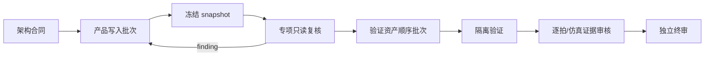

# 角色与分工

[中文导航](README.md) · [整体架构](architecture.md) · [项目优势](advantages.md) · [安装](installation.md) · [使用](usage.md)

## 角色体系的设计目标

13 个角色不是为了让每个任务都变得复杂，而是把下列责任分开：

```text
谁定义问题
谁能修改产品源码
谁编写验证资产
谁审核时钟/接口/厂商/板级风险
谁按时钟拍复核
谁最后签核
```

同一任务只调用真正相关的角色。

## 13 个角色与各自优势

| 角色 | 主要能力 | 权限 | 为什么有价值 |
|---|---|---|---|
| `fpga_architect` | 需求、工程身份、动态任务、影响锥、微架构、预算、验收和路由 | 严格只读 | 防止在未理解工程时直接改代码；让后续问题可以动态补充或替换当前任务 |
| `fpga_engineer` | RTL、官方 IP、构建流、物理实现、发布打包 | 唯一默认产品写入 | 避免多个 Agent 同时修改产品源；每个批次只激活一个明确模式 |
| `verification_engineer` | TB、reference model、assertion、scoreboard、coverage、回归 | 验证资产顺序写入；产品只读 | 从需求建立验证，而不是根据 DUT 当前行为调整 expected；不能自签 |
| `fpga_temporal_evidence_reviewer` | FSM、pipeline、FIFO/RAM、valid/ready 的逐拍和仿真证据审核 | Shadow 严格只读 | 专门发现差一拍、旧值误解、stall 错推进、metadata 错位和自动 checker 漏报 |
| `fpga_cdc_timing_reviewer` | clock/reset、CDC/RDC、constraint、I/O timing、STA、physical QoR | 严格只读 | 把 crossing 结构、约束覆盖和时序闭合分开判断，避免错误 waiver |
| `fpga_interface_architect` | CSR、command、mailbox、IRQ、DMA、端序、原子性和版本兼容 | 严格只读 | 防止 FPGA/固件接口分叉，重点检查 W1C、并发事件、ownership 和错误恢复 |
| `fpga_vendor_platform_reviewer` | Xilinx/Pango/Anlogic、原语、官方 IP、wrapper、target 和工具流 | 严格只读 | 防止跨厂商套用语义，确保 IP、primitive、constraint 和工具版本匹配 |
| `fpga_board_validation_engineer` | 安全上板步骤、ILA/SignalTap、示波器、逻辑分析仪和日志解释 | 严格只读 | 把仿真、实现和板级证据分开；提供前置条件、停止条件和观测方案 |
| `fpga_reviewer` | 集成 task/snapshot、专项证据、finding 和剩余风险 | 严格只读 | 不参与原实现、不自行修复；只对当前声明和当前 snapshot 给出终审结论 |
| `system_architect` | FPGA、硬件、固件跨领域架构 | 条件只读 | 只在真正跨领域时启用，避免普通 FPGA 小改被过度扩大 |
| `embedded_engineer` | FPGA 相关 driver、CSR、IRQ、DMA 固件 | 条件顺序写入 | 在接口合同确定后单独写固件，不与产品 RTL 写入批次重叠 |
| `hardware_datasheet` | 器件型号、手册版本、页码/表格、电气和模型证据 | 条件只读 | 防止凭记忆补器件参数、时钟、复位、电平或模型行为 |
| `independent_reviewer` | 跨 FPGA/硬件/固件或安全关键发布审核 | 条件只读 | 为跨领域高风险 release 提供额外独立审查，不机械参与普通任务 |

## 角色分层

### 控制与架构层

```text
fpga_architect
system_architect（条件）
```

负责定义任务、影响范围、接口和验收，不写产品代码。

### 顺序写入层

```text
fpga_engineer
verification_engineer
embedded_engineer（条件）
```

三者写入批次不能重叠。`fpga_engineer` 是唯一默认产品写入者；verification 和 firmware 只写各自资产。

### 专项监督层

```text
fpga_temporal_evidence_reviewer
fpga_cdc_timing_reviewer
fpga_interface_architect
fpga_vendor_platform_reviewer
fpga_board_validation_engineer
hardware_datasheet
```

只审核自己专业域，不修改产品源，也不替代其他专项。

### 签核层

```text
fpga_reviewer
independent_reviewer（条件）
```

集成证据、处理冲突、检查未关闭 finding 和剩余风险。

## `fpga_engineer` 五种模式

每个产品写入批次只能激活一个主模式：

| 模式 | 写入责任 | 不自动包含 |
|---|---|---|
| `RTL_IMPLEMENTATION` | RTL、wrapper 和必要约束 | IP 重生成、P&R、release |
| `IP_INTEGRATION` | 官方配置、再生成 recipe、工程集成和 proof packet | 网上配置、近似 stub、跨版本猜测 |
| `BUILD_FLOW` | BAT/Tcl/DO、filelist、路径、库和工具入口 | 为脚本失败修改产品 RTL |
| `PHYSICAL_IMPLEMENTATION` | 基于真实报告的 QoR 和 timing closure | 随机换 seed、全局 Pblock、盲目插拍 |
| `RELEASE_PACKAGING` | 明确授权的 bit/bin/mcs、manifest、hash 和命名 | Flash、外部上传或板级动作 |

模式变化必须形成新的 task delta；同一工程之前允许过某个动作，不代表以后永久授权。

## 写入与审核顺序



## 为什么 Reviewer 不直接修复

Reviewer 如果直接修改代码，会同时成为：

```text
问题发现者
+
修复作者
+
证据解释者
+
签核者
```

这会削弱独立性。正确流程是 reviewer 提交稳定 finding，原实现者最小修复，再由 reviewer 对新 snapshot 复核。

## 为什么 Verification Engineer 不能自签

验证资产也可能存在错误：model 跟随 DUT、latency expected 被改、scoreboard 未排空、canary 无效、脚本没有真正运行。验证作者负责创建资产和报告原始结果，独立 reviewer 负责判断这些资产是否真的证明了需求。

## 为什么不是每次调用所有角色

- 路径和工具诊断：架构师 + 工具相关专项；
- 局部接口不变小改：架构师 + 产品实现者 + 验证复核 + 终审；
- CDC、官方 IP、寄存器、物理实现：增加对应专项；
- 跨硬件/固件或安全关键发布：增加 system/independent reviewer。

未触发的专业域不机械阻塞当前任务。
